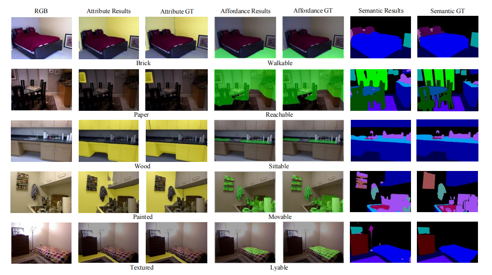
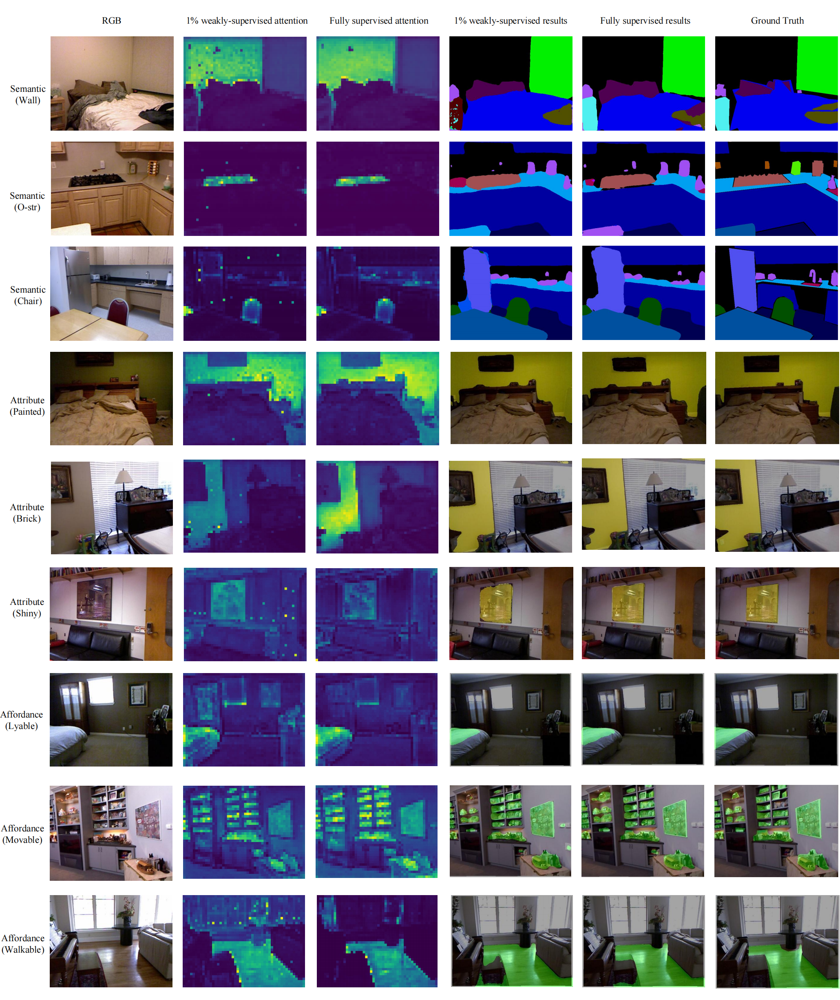

# Cerberus Transformer: Joint Semantic, Affordance and Attribute Parsing

[**Paper**](https://arxiv.org/pdf/2111.12608.pdf) 

## Introduction

Multi-task indoor scene understanding is widely considered as an intriguing formulation, as the affinity of different tasks may lead to improved performance. In this paper, we tackle the new problem of joint semantic, affordance and attribute parsing. However, successfully resolving it requires a model to capture long-range dependency, learn from weakly aligned data and properly balance sub-tasks during training. To this end, we propose an attention-based architecture named Cerberus and a tailored training framework. Our method effectively addresses aforementioned challenges and achieves state-of-the-art performance on all three tasks. Moreover, an in-depth analysis shows concept affinity consistent with human cognition, which inspires us to explore the possibility of extremely low-shot learning. Surprisingly, Cerberus achieves strong results using only 0.1\%-1\% annotation. Visualizations further confirm that this success is credited to common attention maps across tasks. Code and models are publicly available.

## Citation

If you find our work useful in your research, please consider citing:

    @misc{chen2021cerberus,
        title={Cerberus Transformer: Joint Semantic, Affordance and Attribute Parsing}, 
        author={Xiaoxue Chen and Tianyu Liu and Hao Zhao and Guyue Zhou and Ya-Qin Zhang},
        year={2021},
        eprint={2111.12608},
        archivePrefix={arXiv},
        primaryClass={cs.CV}
    }

## Installation

### Requirements
    
    torch==1.8.1
    torchvision==0.9.1
    opencv-python==4.5.2
    timm==0.4.5

### Data preparation

#### Attribute

#### Affordance

#### Semantic

## Run Pre-trained Model

You can download pre-trained Cerberus model [HERE](https://drive.google.com/file/d/1AX_UYa44uW_aPOSykO06GMcfo8mHDRx6/view?usp=sharing).

## Training and evaluating

To train a Cerberus on NYUd2 with a single GPU:

    CUDA_VISIBLE_DEVICES=0 python main.py train -d [dataset_path] -s 512 --batch-size 2 --random-scale 2 --random-rotate 10 --epochs 200 --lr 0.007 --momentum 0.9 --lr-mode poly --workers 12 

    
To test the trained model with its checkpoint:

    CUDA_VISIBLE_DEVICES=0 python main.py test -d [dataset_path]  -s 512 --resume model_best.pth.tar --phase val --batch-size 1 --ms --workers 10

